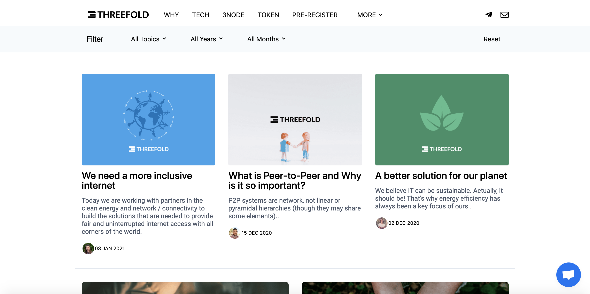

# Blog Publisher

## How does it work?

For blog creation and management there are may options available in the market. From total end-to-end solutions like Squarespace, to doing-it-yourself and selecting the tools and software to run your blog. ThreeFold has created a tool that allows for deployment and blog management with version control, automatic update, and staging facilities.

## What do you need to do?

First, please note that in order to deploy a blog using this tool, you'll need some technical knowledge of Git.
 
 
The basic principle is that you create the content in the repository (html, markdown). Content creation can be done with any tools that you have experience with (or like). For example, you can use Github, but also ThreeFold's decentralized Gitea solution. The only requirement is that you store the content in a public or private repository. The actual deployment of the webserver infrastructure and all required domain setup for the blog to be publicly available is done in a one-click (and three questions) deployment.
 
 
See: [ThreeFold Farming Blog](https://farming.threefold.io/blog) as an example.

## How to Deploy

Please visit [the Marketplace Wiki](https://threefold.io/info/cloud#/cloud__evdc_marketplace) to find further instructions!
 
 
If you need any support, please join [our Testing Community](https://bit.ly/tftesting) or visit [our forum](https://forum.threefold.io)!

<!-- 
### Deploy

create widget which does following,
widget needs to be here in iframe

- [ ] size: small/mid/large
  - small limited amount of visitors per month
  - large ...
- [ ] location (mention more locations coming soon)
  - Ghent
  - Vienna
- [ ] name
  - name as used in solution (in the webui and on web)
- [ ] domain (name is prefix of this)
  - ava.tf
  - 3x0.me
  - refit.earth
  - co30.org
  - ninja.tf
  - base.tf
  - tf9.io
- [ ] git url
  - check in wizard git url works
- [ ] sshkey yes/no
  - if yes, ask sshkey for remote login

  - always deploy on ipv6 public
  - always deploy on webgateway

## Manual

- link to manual (TODO: check good enough)

 -->
