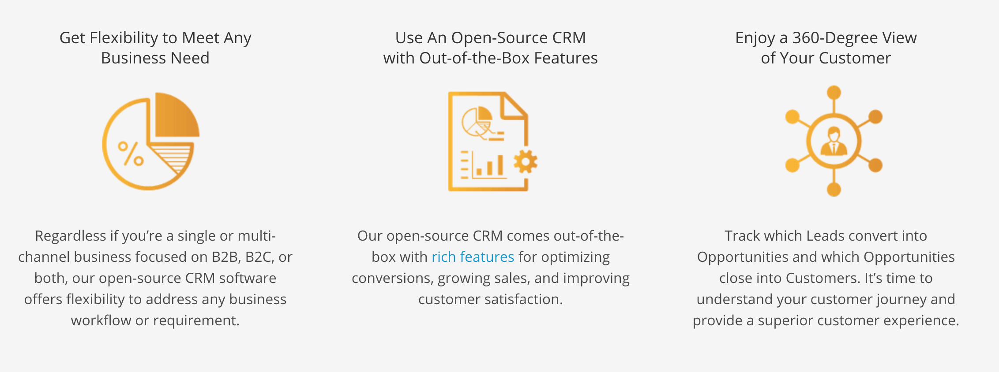
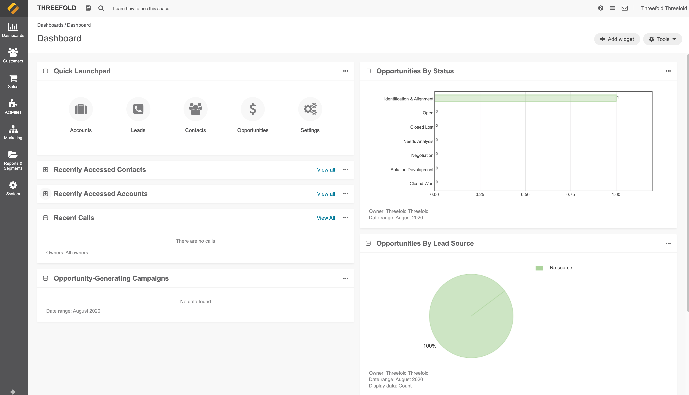

# CRM

 

Customer Relationship Management (CRM) means knowing your customers inside and out, while being able to anticipate future needs. Businesses small and large all around the world are looking for tools to be able to manage their customer relationships. And when it comes to customer data, safety and security are of the highest priority.

## Open Source Solution: OroCRM

[OroCRM](https://oroinc.com/orocrm/) allows you to grow your business using a highly-flexible CRM.

## Why OroCRM?

OroCRM provides a full featured CRM system that provides fantastic functionality:
 
 
- Accounts and Contacts Management
- Leads and Opportunities Management
- 360° View of Your Customer
- Sales and Marketing Performance Dashboards
 
 

And provides the safety and security you are looking for when it comes to your customers' data.
 
 

 

> This software is supported & created by [Oroinc](https://oroinc.com/)  
> Please contact them for any support or commercial license.

## How to Deploy

Please visit [the Marketplace Wiki](https://threefold.io/info/cloud#/cloud__evdc_marketplace) to find instructions, if available. Note: Not all apps are yet live.
 
 
If you need any support, please join [our Testing Community](https://bit.ly/tftesting) or visit [our forum](https://forum.threefold.io)!

<!-- Create widget which does following

- [ ] Choose a size: small/mid/large
  - Small recommended < 5 people
  - Mid recommended 5-25 people
  - Large recommended >25 people
- [ ] Choose a location (many more locations coming soon)
  - Ghent
  - Vienna
- [ ] Select a name
  - Name as used for the solution (in the web UI)
- [ ] Choose a domain name
  - ava.tf
  - 3x0.me
  - refit.earth
  - co30.org
  - ninja.tf
  - base.tf
  - tf9.io
- [ ] Set an admin passwd
  - Will be admin/chosen password
- [ ] Upload your public sshkey (expert mode)
  - If yes, ask sshkey

  - Always deploy on ipv6 public
  - Always deploy on webgateway

  -->

> PS: We are planning to ask the OroCMR team to be able to pay for license fees using TFT as part of the wizard.

