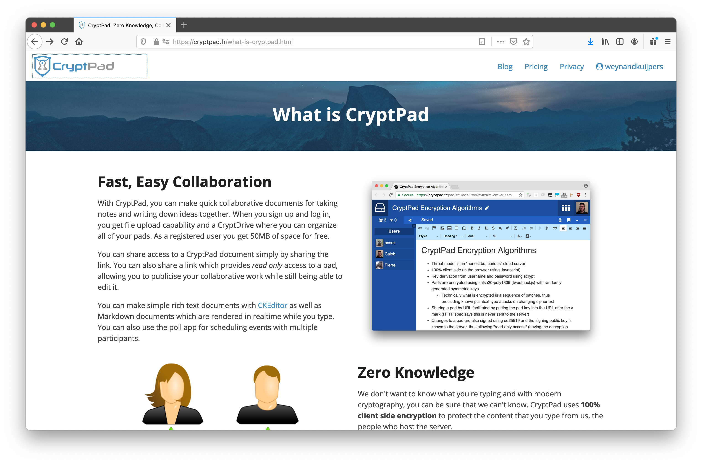
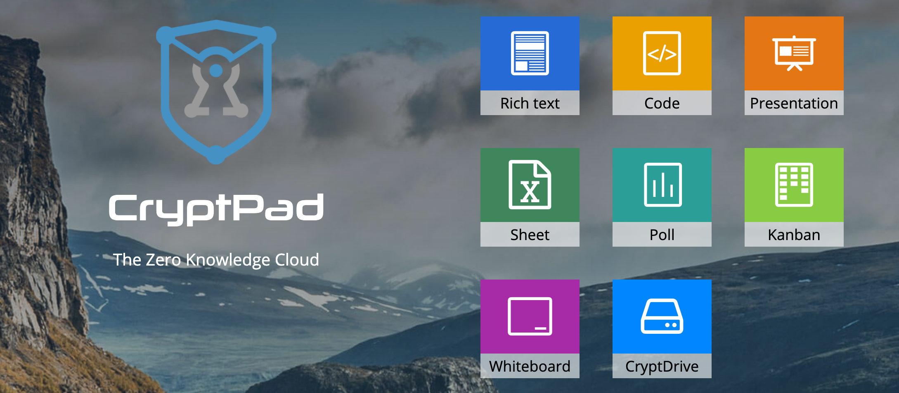
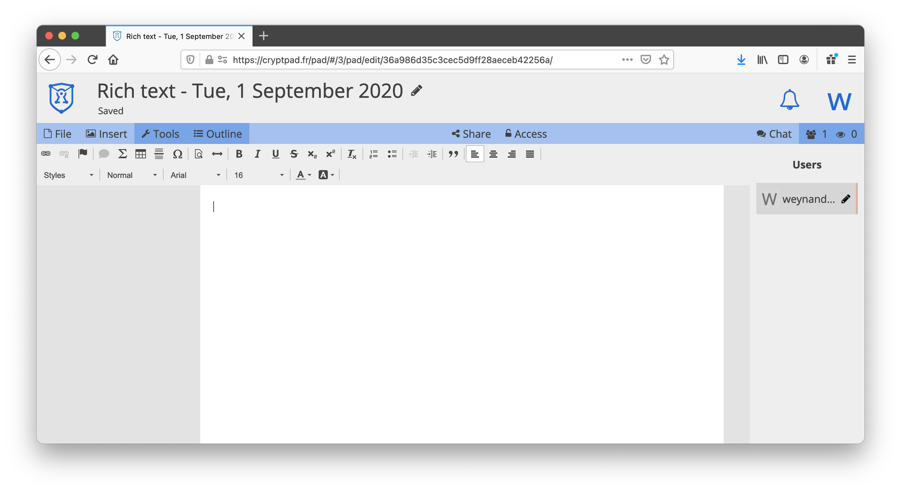
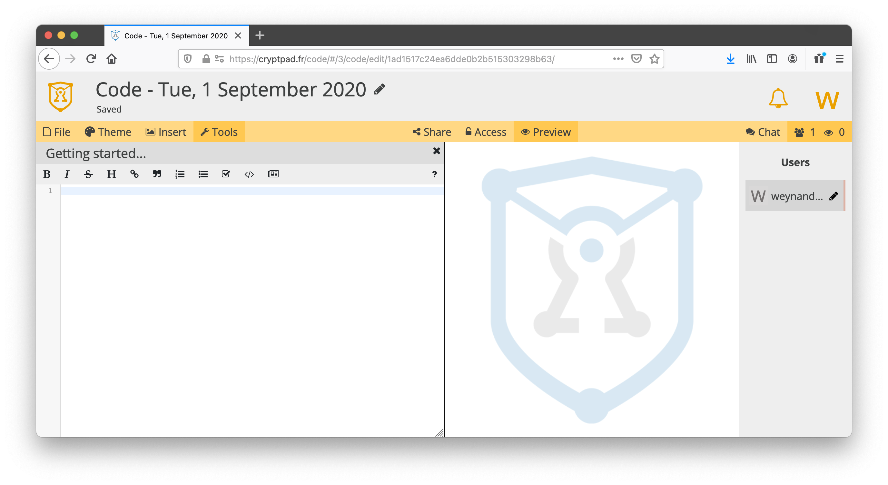
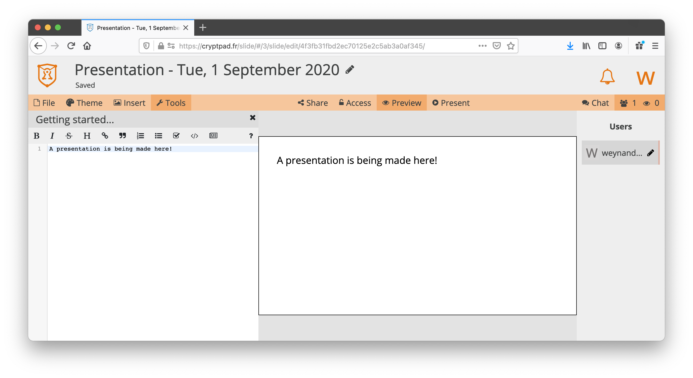
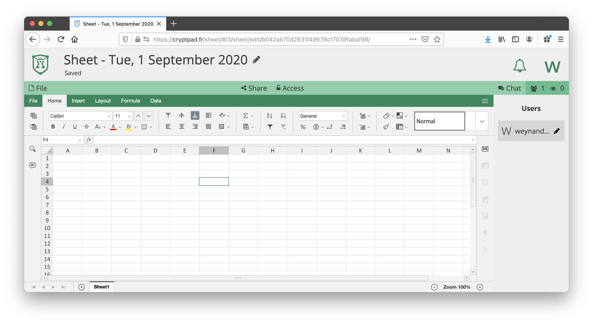
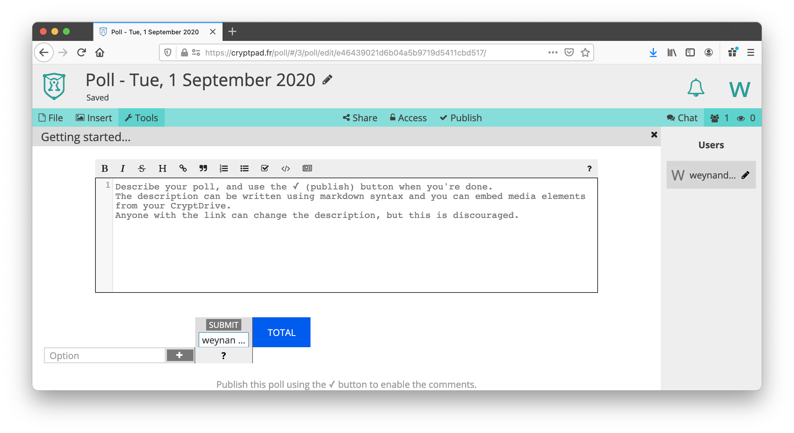
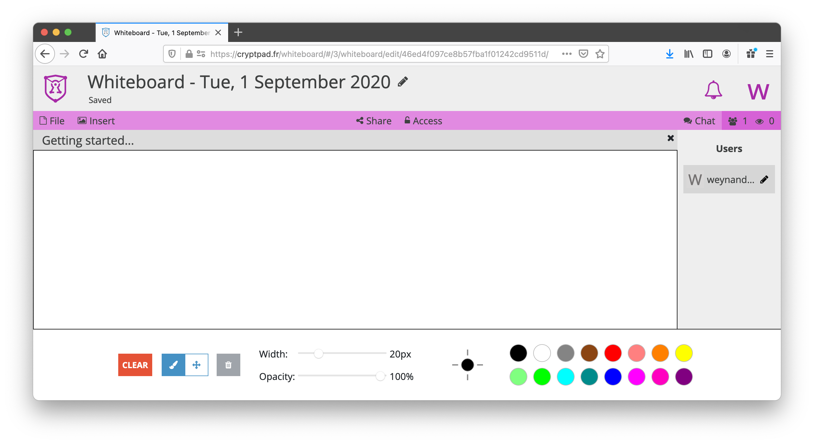
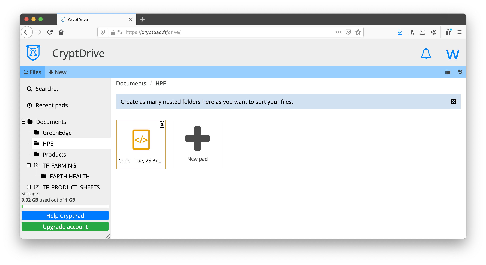

# CryptPad (Collaborative Docs)

Collaborating on documents in real-time is incredible important in today's world. So this solution was a no-brainer.

## Open Source Solution: CryptPad

Many alternatives are available to the the dominant doc collaboration tools from Microsoft and Google, but ThreeFold endorses and supports the [CryptPad.fr](https://cryptpad.fr) open-source CryptPad project – a private-by-design alternative.

## Why CryptPad?

- It has most of the same crucial functionalities you would be used to with existing tools.
- More importantly, all the content stored on CryptPad is encrypted before being sent, which means nobody can access your data unless you give them the keys (not even us).
- Encryption happens in the browser that is used to access the "pads" – and therefore the central storage facility used does not see un-encrypted data and only sees encrypted data passing by.
 
 

 

The ThreeFold team uses it for internal documents and collaboration, and now so can end-users on the ThreeFold Grid. The functionality includes:

## A rich text editor

This is an alternative to Word and Google Docs. It allows you to create documents and to collaborate with others to co-create documents, as CryptPad supports multi-user access to documents for co-editing and collaborations. The sharing facility uses unique access keys allowing other to see the content un-encrypted.

## A code editor

## A presentation creation tool

## A spreadsheet creator and editor

## A poll creation tool

## A Kanban project management tool

## A Whiteboard tool

## An encrypted drive to store files

## How to Deploy

Please visit [the Marketplace Wiki](https://threefold.io/info/cloud#/cloud__evdc_marketplace) to find instructions, if available. Note: Not all apps are yet live.
 
 
If you need any support, please join [our Testing Community](https://bit.ly/tftesting) or visit [our forum](https://forum.threefold.io)!
 
 
**Support CryptPad [here](https://cryptpad.fr/index.html).**
