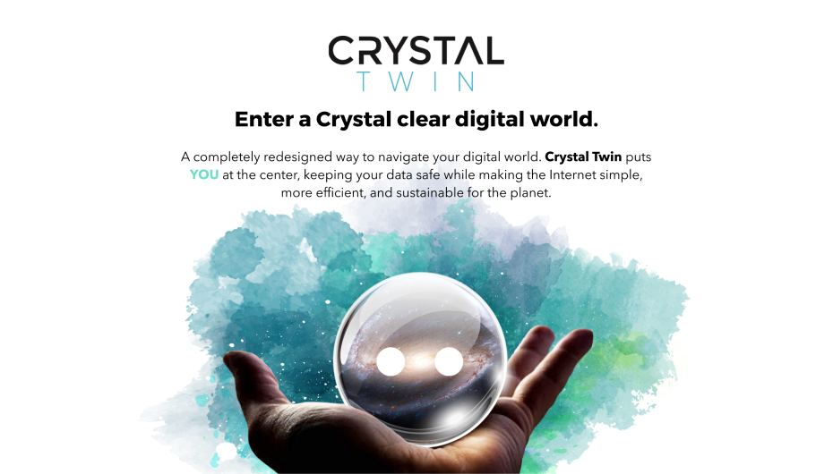

# Crystal Twin
*Your personal Digital Avatar*

 

## What is happening today?

The Internet started out as a dream technology, with the power to connect and empower us all. But now, our online world is full of fake news, identity thieves, bots, bugs, viruses and big “bosses." No matter which way we look at it, the world wide web has gotten out of control.

- We log on to countless different applications with countless different logins, but our data is scattered and owned by others.
- We seek information, but that information is not always verified.
- We store our digital lives, but it's not always secure.
- We share with our loved ones and our networks, but what we share is sometimes tracked and not owned by us.

Our digital lives have become complicated, inefficient, and insecure. The web that was supposed to connect us has started to ensnare us.

## What should be done and How are we solving the problem?

- Crystal Twin is a completely redesigned way to navigate your digital world with YOU at the center. 
- Crystal Twin is your digital ally, keeping your data safe while making the Internet simple, more efficient, and sustainable for the planet.

## Why is Crystal Twin important?

Have you seen The Social Dilemma? Well, we can break away. Crystal Twin creates a bright new and free digital world.