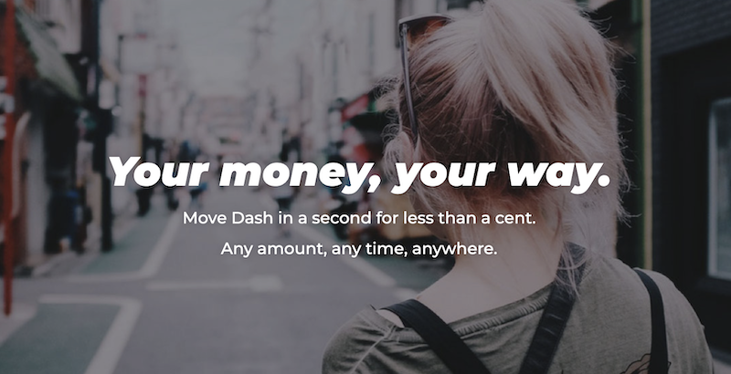

# Dash

## Joint Mission

Giving Dash Full node and Masternode operators extra IT superpowers!

## About Dash 

**[Dash](https://www.dash.org/)** is an open source peer-to-peer cryptocurrency with a strong focus on the payments industry.
 
 

- Dash offers a form of money that is portable, inexpensive, divisible and fast.
- It can be spent securely both online and in-person with only minimal transaction fees.
- Based on the Bitcoin project, Dash aims to be the most user-friendly and scalable payments system in the world.
- In addition to Bitcoin’s feature set, Dash currently also offers instant transactions with InstaSend, private transactions with PrivateSend, and operates a self-governing and self-funding model that enables the Dash network to pay individuals and businesses for work that adds value to the network.
- This decentralized governance and budgeting system makes it one of the first ever successful decentralized autonomous organizations (DAO).

## Dash and ThreeFold

Dash  has established itself as a leader in the digital currency and Blockchain space with their advanced payment mechanism and highly-efficient governance model.
 
 

- With ThreeFold, Dash and its community of Full node and Masternode operators have access to the world's largest P2P cloud capacity.
- With that, they have the ability to easily run Dash nodes at scale and further distribute the network all over the globe, bringing even greater decentralization and data privacy to its DAO infrastructure.
- Dash enthusiasts, developers, and non-developers use ThreeFold and its 3Bot Admin Panel to be part of the Dash network by:
    - running their own Dash full nodes to help secure the network and get incentivized by doing so
    - or by running a Dash Masternode for a more advanced contribution to the Dash governance ecosystem. 

## Get Started

**Coming soon:** You will be able to soon deploy Dash Full nodes and Master nodes via the **ThreeFold Marketplace**'s dashboard, in just a few clicks. Stay tuned!