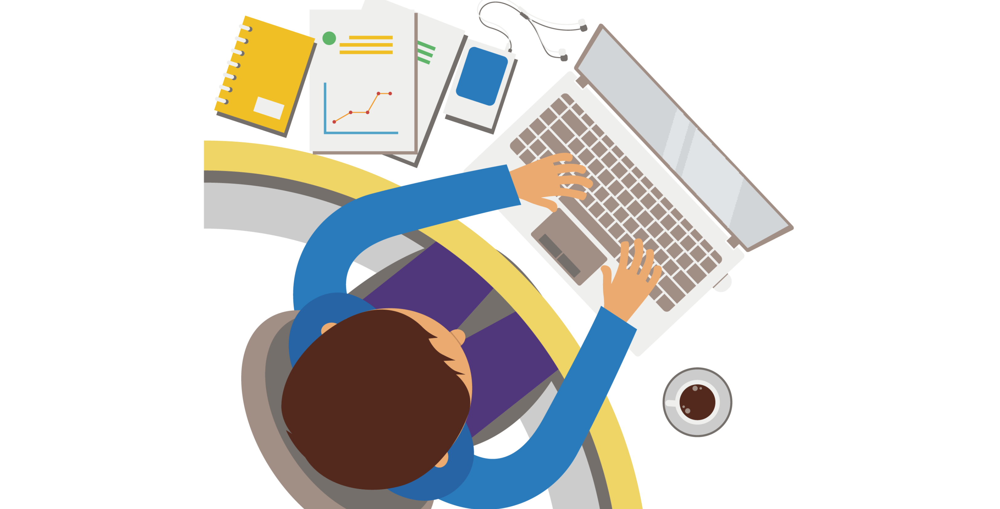
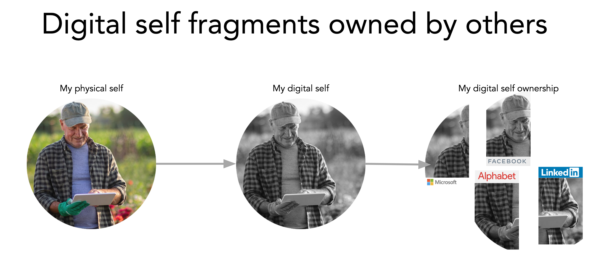

# Intro (DigitalMe)

## What is happening today?

If we are going to decentralize the world, it all starts with you, or "me."

- Today, the "centralized **you**" exists in many different places.
- With every online service, you leave a little trail of your data and scatter another little piece of your online identity.
- This happens over and over with the centralized services you use, creating a lot of data duplication and unnecessary energy consumption.
- The worst part is: you don't own this data, the online service provider does. This needs to change!

## What should be done and How are we solving the problem?

- Your online data should be yours to begin with, and should stay yours for the full duration of your online presence.
- The services you use should be allowed to "see" your data but not own your data.
- To achieve this, **You** should be put in the center and have a digital online self that has access to your data, and the knowledge and capabilities to the things you want to do online.

We've done this with 3Bot, your virtual system administrator 

<!-- These link are no longer valid

ThreeFold Now presents services that use data from you but don't steal and own your data. Currently ThreeFold now is working on:
 - An office suite of applications, [private and secure document creation and editing](../dmcollab)
 - Project management software [kanban tool](../dmcircles)
 - A peer ti peer video sharing service, [peertube](../video-sharing)
 - Video calling and conferencing done the right way, [peer to peer video conferencing](../video-conf)
 - [Virtual online meeting spaces](../virtual-spaces) to meet, collaborate and cocreate.

-->