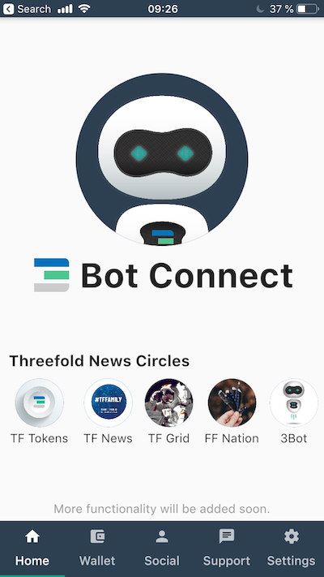

# DigitalMe ID

## What is happening today?

- We log in to applications, social spaces, and online environments through a central username and password system.
- Passwords are too easy to guess or to break and generally require people to remember both their username and password in order to "verify" themselves.
- In the end, this is 1. not true secure verification, as a password can be obtained in any number of ways, and 2. burdensome on the person.

## What should be done and How are we solving the problem?

In a decentralized world, there is no central username and password system to grant you access to applications, development environments, social spaces and in general any online-based service. Verification happens in a more secure way.

- The ThreeFold environment works with an access system based on generic [multi-factor authentication](https://en.wikipedia.org/wiki/Multi-factor_authentication) (more specifically 2-factor authentication, 2FA) by using a cryptographic key pair to do the first verification (cryptographic signing) and using a user response system (icon in a phone app) to do the second verification: 2FA.
- The private key resides *only* in the phone app of the user.
- This (private) key is not stored anywhere on the TF Grid.
- The public key is stored on the grid in a so-called "phone book" for anyone and anything else to access, and is used to verify whether the user has authenticated (signed) the access request.

