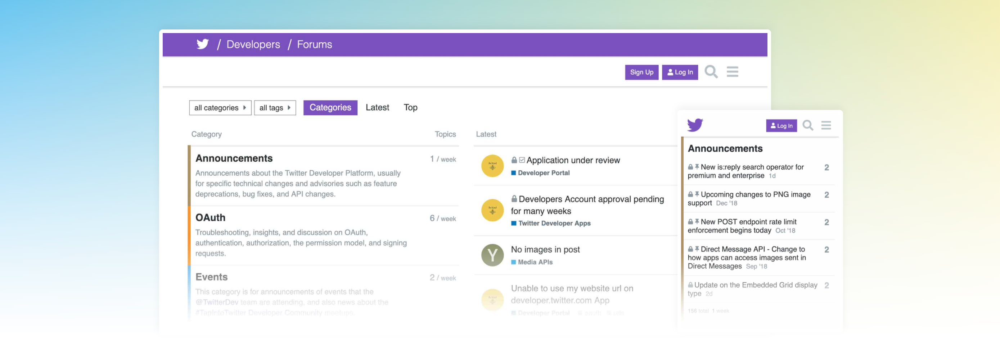

# Discourse (Community Forum)

 

Online communities have been around for decades and they are only increasing in importance and popularity in today's world. We wanted to provide people with an easy (and fun) to use solution to build and manage safe and trusted online communities of their own.

## Open Source Solution: Discourse

[Discourse](https://www.discourse.org/) is modern forum software for your community. Use it as a mailing list, discussion forum, long-form chat room, and more!

## Why Discourse?

We are big fans of Discourse and actually use it for [our forum](https://forum.threefold.io). But why do we love Discourse? Here are a few reasons:
 
 

- It's 100% open source which means we're able to bring it as a solution on the ThreeFold Marketplace!
- The trust system allows the community to easily defend itself from trolls and spammers — and the most engaged forum members can assist in the community's governance. This one is an important differentiator based on our own experience on other platforms.
- Discourse is simple, easy, and well-organized – and has great experiences on desktop and on mobile
 
 

Bonus! Discourse has integration features with [Mattermost](https://mattermost.com/), which is also part of the ThreeFold Marketplace suite.

## How to Deploy

Please visit [the Marketplace Wiki](https://threefold.io/info/cloud#/cloud__evdc_marketplace) to find instructions!
 
 
If you need any support, please join [our Testing Community](https://bit.ly/tftesting) or visit [our forum](https://forum.threefold.io)!