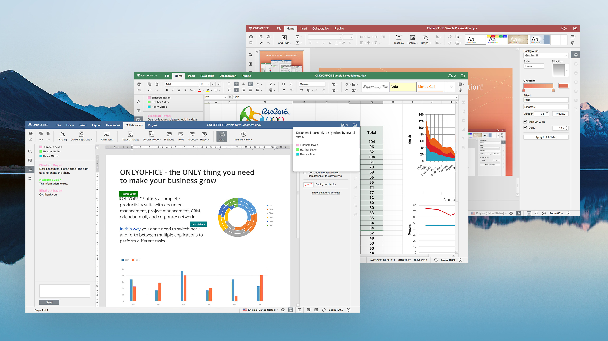

# Document Server (OnlyOffice)

 

If you've used a computer for school or for work, you have surely used one of the Office Application suites out there, most likely from Microsoft or Google. So we needed a peer-to-peer alternative.

## Open Source Solution: OnlyOffice

[ONLYOFFICE](https://www.onlyoffice.com/) is an online office suite integrated with a collaboration platform to manage documents, projects, team and customer relations in one place.

## Why OnlyOffice?

OnlyOffice is a private and secure alternative to the tools we use today. Beyond that:
 
 

- Trusted by more than 7 million users worldwide and highly-rated by both critics and users
- All your online collaboration and file storage needs are covered in one place
- Easy customization and administration
- & more

## Integration with File Browser

We will be integrating the File Browser solution as well so that you can store and edit documents within the same experience.

## How to Deploy

Please visit [the Marketplace Wiki](https://threefold.io/info/cloud#/cloud__evdc_marketplace) to find instructions, if available. Note: Not all apps are yet live.
 
 
If you need any support, please join [our Testing Community](https://bit.ly/tftesting) or visit [our forum](https://forum.threefold.io)!

<!---

### A brief overview of "Office"

- The term "Office" refers to a family of software which allows people to create documents, spreadsheets and presentations. The term was introduced by Bill Gates on August 1, 1988, at COMDEX in Las Vegas. Initially a marketing term for an office suite (bundled set of productivity applications), the first version of Office contained Microsoft Word, Microsoft Excel, and Microsoft PowerPoint. Over the years, Office applications have grown substantially closer with shared features such as a common spell checker, OLE data integration, and Visual Basic for Applications scripting language. 

- Microsoft also positions Office as a development platform for line-of-business software under the Office Business Applications brand. On July 10, 2012, Softpedia reported that Office was being used by over a billion people worldwide.

- Office (Microsoft) has been very successful to become the standard for people, students, and businesses to create and collaborate on documents. Over the years the office product suite moved from a local install to an online version (Office 365) and a number of other products have come to market to challenge that leading position (the Google Docs suite being the largest competitor).