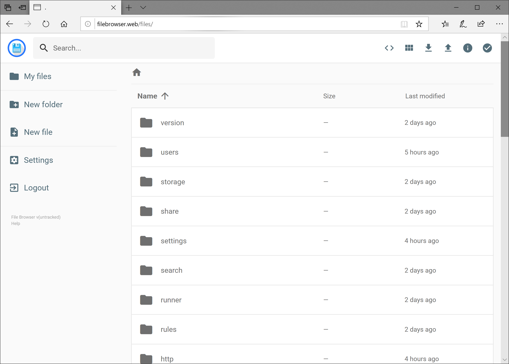

# File Browser

 

We all store important content online, from person and work-related documents, to photos and videos, and beyond. But storing material on centralized cloud solutions is lacking when it comes to security and privacy / data sovereignty. The demand for a decentralized file browser is obvious.

## Open Source Solution: File Browser

[File Browser](https://filebrowser.org/) is an open source, community-led "create your own cloud" type of solution which we have utilized and customized for the ThreeFold Marketplace.

## Why File Browser?

As File Browser states on their website, "we focus on doing one thing, but doing it well." We like what they have brought to the table. In the end, it is a simple but effective tool. Some of they key features include:
 
 

- An easy login system
- A sleek and simple interface
- Manage users, add permissions, set scopes
- Wide range of file types supported
- Edit your files, of course!
 
 

And by authenticating through ThreeFold Connect, you'll be able to access your files anywhere.

## Integration with Office Tools

We will be integrating the Office Tools solution as well so that you can store and edit documents within the same experience.

## How to Deploy

Please visit [the Marketplace Wiki](https://threefold.io/info/cloud#/cloud__evdc_marketplace) to find instructions, if available. Note: Not all apps are yet live.
 
 
If you need any support, please join [our Testing Community](https://bit.ly/tftesting) or visit [our forum](https://forum.threefold.io)!