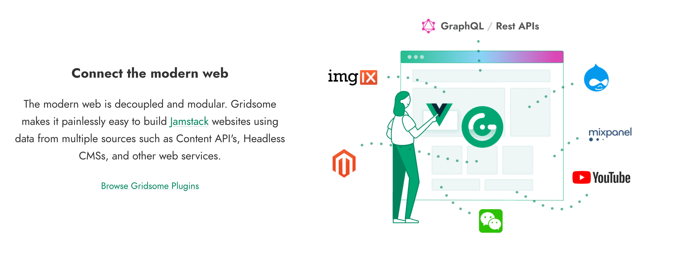
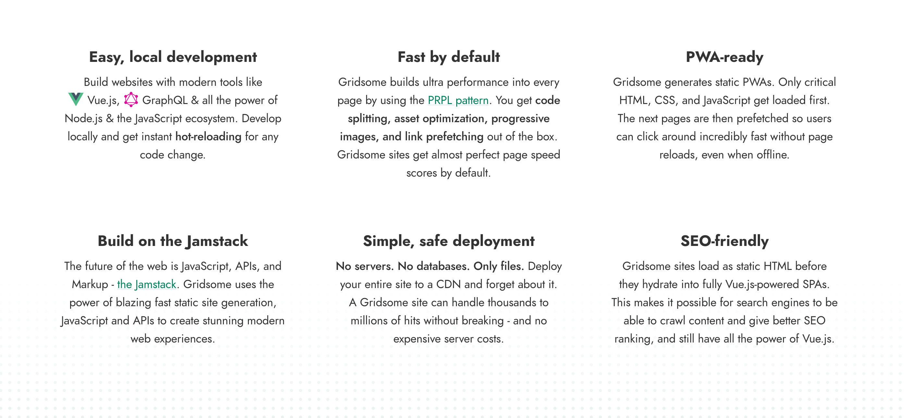

# Gridsome (Modern Site Generator)

_Note: This page is being worked on and will be expanded._

## Open Source Solution: Gridsome

[Gridsome](https://gridsome.org/) is a jamstack framework – a free & open source Vue.js-powered framework for building websites & apps that are fast by default.

## How does it work?

More info on [Gridsome](https://gridsome.org/)

## Why use Gridsome?

## How is it related to our grid?

- Directly deploy on TF Grid
- Build & test before deploy
 
 
More coming ...

## How to Deploy

Please visit [the Marketplace Wiki](https://threefold.io/info/cloud#/cloud__evdc_marketplace) to find instructions, if available. Note: Not all apps are yet live.
 
 
If you need any support, please join [our Testing Community](https://bit.ly/tftesting) or visit [our forum](https://forum.threefold.io)!
