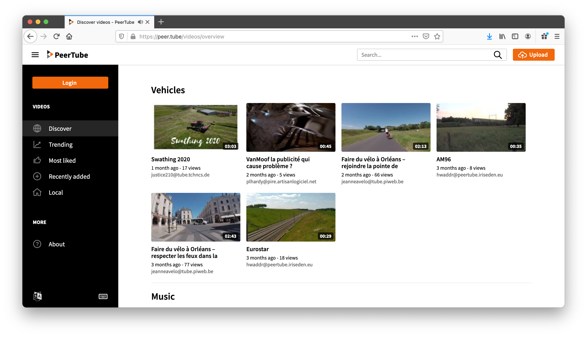

# Peertube (Video Sharing)

 

If you use the Internet, you are surely familiar with video sharing. Sites like YouTube and Vimeo are the biggest examples. They are highly-popular, particularly with the mass market for camera phones and smartphones increasing the supply of user-generated videos.

<!--

## What is a video sharing platform?

- Since the early 2010s, with the increasing prevalence of technology and the Internet in everyday life, video hosting services have served as a portal to different forms of entertainment (comedy, games shows, games, or music), news, documentaries and educational videos.
- Content may be user-generated / amateur clips or commercial-level products.
- The entertainment industry uses this medium to release music, videos, movies and television shows directly to the public.
- Video hosting services are becoming more & more popular, especially with the explosion in popularity of blogs, Internet forums and other interactive pages.

-->

## Why is video sharing getting popular?

- Traditional methods of personal video distribution, such as making a DVD to show to friends at home, are unsuited to the high volume of camera phone clips.
- In contrast, current broadband Internet connections are well suited to serving video shot on mobile phones.
- Since most people do not operate web servers (as this requires a specific knowledge of how to do this), video content hosting has become a high-demand offering.
- The popularity of such video sharing platforms has spawned massive organizations presenting platforms on which people and businesses can share their videos.
- Most of these platforms have built a business model around tracking video consumption interests and statistics, and using this data for marketing purposes or selling it to organizations for (big) data analysis.
- They can do so because the platform forms the central hub (in a hub and spoke model) where video producers reach video consumers by using this platform to connect.

## What makes our solution different?

ThreeFold advocates that video sharing can exist without a central platform (and organization) in the middle. You as a producer or consumer can create your own facility to share videos. There is open source software available to do so.

## Open Source Solution: PeerTube

- ThreeFold endorses [PeerTube's](https://joinpeertube.org/) decentralized implementation of a video sharing platform. The open source project has a [roadmap](https://joinpeertube.org/roadmap) that is ambitious and needs support. Please help us to help PeerTube.
- PeerTube is a free and open source video platform that was officially launched on October 11, 2018, and is intended to offer an alternative to platforms such as YouTube, Vimeo, and Dailymotion.
- Similar to the open source Twitter alternative Mastodon, PeerTube is decentralized, meaning that it is not hosted by a single person, company, or server.
- Because it is open source, anyone can make their own “instance” of PeerTube, which has its own appearance, account management, moderation policy, and so on.
- Instances can also come together to form Federations, essentially several instances that agree on the same broadcast conditions and share videos between them.
- Each video is stored by the instance that published it, but can be viewed by other instances in the Federation. In turn, Federations are distinct and independent from one another.

## PeerTube - Want to join now?

[Here](https://joinpeertube.org/) is the official join PeerTube page, so you can read all the details.

<!--
 <iframe width="1024" height="786"
src="https://framatube.org/videos/watch/9c9de5e8-0a1e-484a-b099-e80766180a6d?subtitle=en">
</iframe> 
-->

## Deploy your own YouTube, super powerful & decentralized

Unique characteristics of the platform:
 
 
- PeerTube aspires to be a decentralized and free/libre alternative to video broadcasting services. The TF Grid present a fantastic fabric of compute and storage capabilities for this distributed and federated platform.
- It is a network of inter-connected small videos hosters
- An open-source, free/libre license code 
- Deploying PeerTube on the TF Grid is a one-click solution and will get you a private instance on which to host your videos
- The TF Grid is a federation of people and companies that believe the Internet should be put back in the hands of people, not large monopolies currently dominating the landscape. Direct contact with a human-scale hoster (which ThreeFold calls farmers) allows for two things: you no longer are the client of a huge tech company, and you can nurture a special relationship with your hoster (farmer), who distributes your data
- The PeerTube software can, whenever necessary, use a peer-to-peer (P2P protocol to broadcast viral videos, lowering the load of their hosts
> Help PeerTube, as they are [fundraising](https://joinpeertube.org/roadmap). With little, they can make this software even much better than it is today.

## How to Deploy

Please visit [the Marketplace Wiki](https://threefold.io/info/cloud#/cloud__evdc_marketplace) to find instructions!
 
 
If you need any support, please join [our Testing Community](https://bit.ly/tftesting) or visit [our forum](https://forum.threefold.io)!

<!--

## How to use PeerTube with our platform

Create a link to the Threefoldnow marketplace.  Talk througf the steps / Q&A that are required to deploy a peertube

- Step 1:  Get yourself a 3bot app installed on you phone for access to the TF Grid
- Step 2: Get some digital currency (TFT, ..., ..., ...)
- Step 3: Get a [peertube account](https://joinpeertube.org/instances)
- Step 4:  -->

<!--
create widget which does following,
widget needs to be here in iframe

- [ ] size: small/mid/large
  - small: ...
  - mid: ...
  - large ...
- [ ] location (mention more locations coming soon)
  - Ghent
  - Vienna
- [ ] name
  - name as used in solution (in the webui and on web)
- [ ] domain (name is prefix of this)
  - ava.tf
  - 3x0.me
  - refit.earth
  - co30.org
  - ninja.tf
  - base.tf
  - tf9.io
- [ ] git url
  - check in wizard git url works
- [ ] sshkey yes/no
  - if yes, ask sshkey for remote login

  - always deploy on ipv6 public
  - always deploy on webgateway

-->
