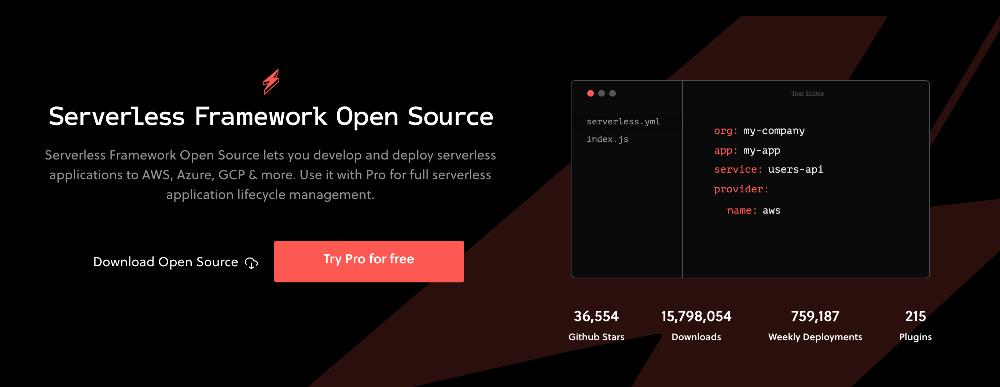

# Serverless App Framework

 
*Note: This page is being worked on and will be expanded.*
 
 
Software is eating the world. Unfortunately, most businesses still can't deliver software successfully, and very few do so at the pace needed to stay competitive. For those who wish to keep up, let alone lead, software delivery & operation must be radically simplified.

## Open Source Solution: Serverless

[Serverless](https://www.serverless.com/) is built on next-generation public cloud services that auto-scale and charge only when used. When scale, capacity planning & cost management are automated, the result is software that's easier to build, maintain, and often up-to 99% cheaper.
 
 

But, Serverless Architectures are new and therefore require a shift in how we previously thought about architectures & workflows. The goal at Serverless Inc. is to give developers, teams and orgs all of the tools they need to build and operate serverless applications in one simple, powerful & elegant experience.

## Why use Serverless?

Coming ...

## How is it related to our grid? 

Coming ...

## Serverless Apps that can run on the grid

Coming ...

## How to Deploy

Please visit [the Marketplace Wiki](https://threefold.io/info/cloud#/cloud__evdc_marketplace) to find instructions, if available. Note: Not all apps are yet live.
 
 
If you need any support, please join [our Testing Community](https://bit.ly/tftesting) or visit [our forum](https://forum.threefold.io)!

