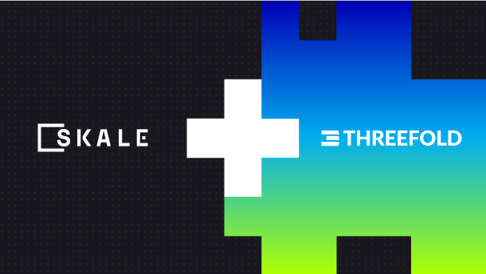

# SKALE Network

## Joint Mission

Solving scalability and decentralization limitations faced by Ethereum developers!

## About SKALE Network

**[SKALE](https://skale.network/)** is an elastic blockchain network that gives developers the ability to easily provision highly configurable fully decentralized chains that are instantly compatible with Ethereum.
 
 

- SKALE chains can execute sub-second block times, run up to 2,000 tps per chain, and run full-state smart contracts in addition to decentralized storage, execute Rollups, and machine learning in EVM.
- The SKALE Network is an open-source project with many contributors including SKALE Labs.

## SKALE Network and ThreeFold

The SKALE and ThreeFold collaboration focuses on solving scalability and decentralization limitations faced by Ethereum and blockchain developers. The effort empowers the SKALE developer community, and Web3 developers, with the ThreeFold Peer-to-Peer Cloud, enabling them to:
 
 

- Build highly scalable dApps on Ethereum using SKALE’s elastic Blockchain network
- Completely decentralize their IT infrastructure using ThreeFold’s P2P compute, storage, and networking capacities, providing far more affordability, privacy, and decentralization through its native cloud automation and Smart Contract for IT

## Get Started

**Coming soon:** You will be able to soon run SKALE validator nodes via the **ThreeFold Marketplace**'s dashboard in a few clicks. Stay tuned!