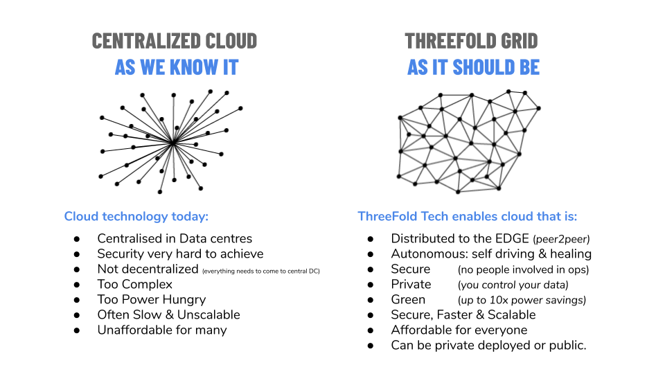

# The ThreeFold Grid

ThreeFold Now would not be possible without the ThreeFold Grid. So, we'll provide a bit of context on the grid here. **You can feel free to skip to the next section if you're already familiar.**

## The Internet's Origins & Centralized Cloud

The Internet started in the last century as a sharing mechanism by people, for people. Somehow along the way, it morphed into an oligopolistic market where a few companies own and rule it all.

- This is not in line with the original intention of the Internet or what the Internet was all about.
- Further, an increasing number of people are realizing that the current delivery model for cloud services is not scalable and will not deliver services to people globally in an efficient matter.
- A centralized approach for delivering cloud services provides efficiencies *only* to the providers of these services.

## Decentralized Cloud

Decentralized cloud is a cloud that is provided by people, for people.

- To scale out and deliver the exponential increase in required data processing and storage capabilities, a new model is needed – a model in which people own servers and share these servers out to other people to use.
- This should be possible for individual people and companies. By many, for everyone.
- ThreeFold Tech is building the technology to do this and the ThreeFold Foundation is promoting and marketing the ThreeFold Grid, [the the largest peer-to-peer grid on the planet](https://threefold.io/).

## The ThreeFold Grid 

The ThreeFold Grid is the largest active decentralized cloud in the world.

- People around the world plug in computers (servers) to add capacity.
- The data inside these servers is owned by the people who put the data there, not by large corporations who then sell and exploit it for their own benefit.
- Then developers build solutions and end users come to experience them.

**The ThreeFold Grid is the foundation. Without it, the ThreeFold Now Marketplace would not be possible. Without it, we cannot reclaim our digital freedom.**

*If you'd like to read more about the ThreeFold Grid, please visit the [website](https://threefold.io) or [wikis](https://library.threefold.me/info/threefold).*

<!--

## Centralized Cloud

_(Content redacted from [Wkipedia](https://en.wikipedia.org/wiki/Cloud_computing))_

Cloud computing is the on-demand availability of computer system resources, especially data storage (cloud storage) and computing power, without direct active management by the user. The term is generally used to describe data centers full of servers available to many users over the Internet. Large clouds provide services to users from central locations and often have multiple locations. This service delivery model is called "centralized" cloud because all the necessary capital, equipment and knowledge are owned by one organization (or person). 

Cloud computing allows companies to avoid or minimize up-front IT infrastructure costs and lead to higher usage and efficiency rates of servers. Cloud computing usually also allows enterprises to get their applications up and running faster, with improved manageability and less maintenance. It enables IT teams to more rapidly adjust resources to meet fluctuating and unpredictable demand by using the cloud to provide burst computing capability.

The public cloud market is dominated by a few companies that own the majority of public cloud services. Gartner estimate and projects the market to be more than 350 Billion USD by 2022.

 Table 1. Worldwide Public Cloud Service Revenue Forecast (Billions of U.S. Dollars) (source [Gartner](https://www.gartner.com/en/newsroom/press-releases/2019-11-13-gartner-forecasts-worldwide-public-cloud-revenue-to-grow-17-percent-in-2020))
	

|    | **2018** | **2019** | **2020** | **2021** | **2022** |
| ---| --- | ---- | ---- | ---- | ---- |
| **Cloud Business Process Services (BPaaS)** | 41.7 | 43.7 | 46.9 | 50.2 | 53.8 |
| **Cloud Application Infrastructure Services (PaaS)** | 26.4 | 32.2 | 39.7 | 48.3 | 58.0 | 
| **Cloud Application Services (SaaS)** | 85.7 | 99.5 | 116.0 | 133.0 | 151.1 |
| **Cloud Management and Security Services** | 10.5 | 12.0 | 13.8 | 15.7 | 17.6 |
| **Cloud System Infrastructure Services (IaaS)** |32.4 | 40.3 | 50.0 | 61.3 | 74.1 |
| **Total Market** | **196.7** | **227.8** | **266.4** | **308.5** | **354.6** | 

# ThreeFold Grid 

## Too much to fit here ! Why not see the link below ?

- [ThreeFold Decentralized Grid](https://cloud.threefold.io)

-->