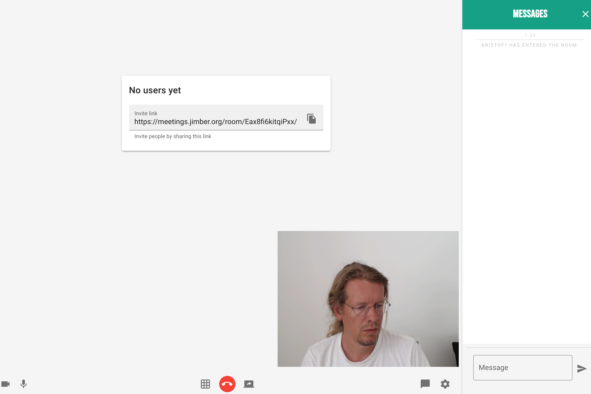
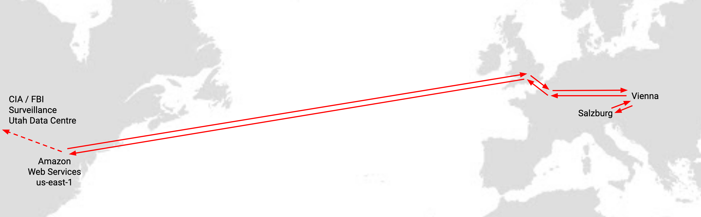

# Video Chat

 

Online services that provided end user-friendly video conferencing solutions are in high demand, and many of the providers of such services have seen a tremendous increase in usage statistics. Using centralized services for video conferencing creates silos of users that can communicate because they use the same tool. And it allows the man in the middle – the video conferencing platform – to collect and market data captured by end user usage.

## How do other solutions work?

- When Zoom became a very popular (free of charge) video conferencing solution, they changed the policy in terms of how you connected through their platform to others uses.
- In this case, if you had a free account, all free account users were connected through US based Zoom (central) infrastructure.
- This leads to very inefficient capacity usage and the potential for oversight by US agencies and authorities. 

## Example of the current solution

This examples is for two users of the Zoom service with a free account based in Salzburg and Vienna (both in Austria).
 
 

 

## How our solution works and what makes it different

In an ideal world, two two users would connect directly. There is no need to make this connection go through any infrastructure that is not in line to make the connection, and this can be done by creating a so called peer-to-peer video conferencing solution.
 
 

 

Such a peer-to-peer video conferencing solution has been created and exists on the ThreeFold Grid and within the ThreeFold Marketplace. It has been designed and built by the ThreeFold Tech team and will have a one-click deployment option.  

## How to Deploy

Please visit [the Marketplace Wiki](https://threefold.io/info/cloud#/cloud__evdc_marketplace) to find instructions!
 
 
If you need any support, please join [our Testing Community](https://bit.ly/tftesting) or visit [our forum](https://forum.threefold.io)!

<!--

-->

<!-- ### Deploy

_The solution needs to appear in the threefold now one click solutions board.  Needs to be linked and an explanation (high level depending on how good the local explanation in the deployment process is needs to be provided here_

_create widget which does following,
widget needs to be here in iframe_ -->

<!--

- [ ] size: small/mid/large
  - small: ...
  - mid: ...
  - large ...
- [ ] location (mention more locations coming soon)
  - Ghent
  - Vienna
- [ ] name
  - name as used in solution (in the webui and on web)
- [ ] domain (name is prefix of this)
  - ava.tf
  - 3x0.me
  - refit.earth
  - co30.org
  - ninja.tf
  - base.tf
  - tf9.io
- [ ] git url
  - check in wizard git url works
- [ ] sshkey yes/no
  - if yes, ask sshkey for remote login

  - always deploy on ipv6 public
  - always deploy on webgateway
-->
