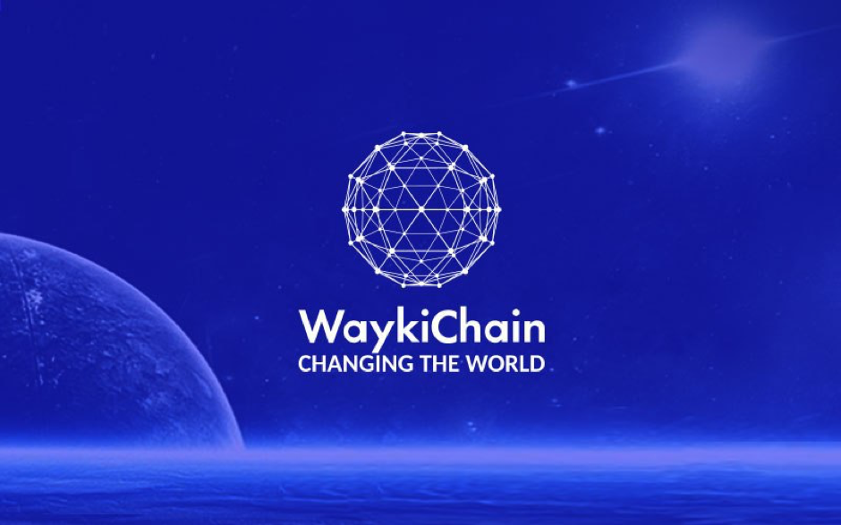

# WaykiChain

 

## Joint Mission

Providing the cloud infrastructure to WaykiChain's node operators!

## About WayKiChain

**[WaykiChain](https://www.waykichain.com/)** is a prominent blockchain platform based in China with a global community.
 
 

- It is a DPoS (Delegated Proof of Stake) public blockchain that is highly scalable and with high-performance transaction processing capabilities (TPS 3300) and an efficient consensus mechanism.
- WaykiChain has a variety of product lines, with the WaykiChain core wallet, the WaykiTimes and their DeFi-vertical technologies that are built within the core layer of blockchain, i.e. the crypto-asset backed stablecoin technology as well as its built-in decentralized exchange.
- Waykichain’s blockchain enables developers to build performing dApps on top of it using its developer tools, and has throughout these 3 years, built an extended ecosystem of Dapps.

## WaykiChain and ThreeFold 

ThreeFold and WaykiChain found clear alignment on decentralizing the Internet for people and businesses and share the same core values that encompass their respective visions.
 
 

- By using The ThreeFold P2P cloud and the 3Bot, The WaykiChain community of developers, non-developers, and node operators are enabled to deploy and maintain their WaykiChain nodes and any of their IT workloads in just a few clicks directly from the browser or from a local machine. 
- ThreeFold's compute, storage, and networking capacities empower them to decentralize their cloud-computing infrastructures, with far more affordability and distribution compared to centralized cloud-providers, and with native cloud automation via ThreeFold’s Smart contract for IT.

## Get Started

**Coming soon:** You will be able to soon deploy WaykiChain nodes via the **ThreeFold Marketplace**'s dashboard in a few clicks. Stay tuned!