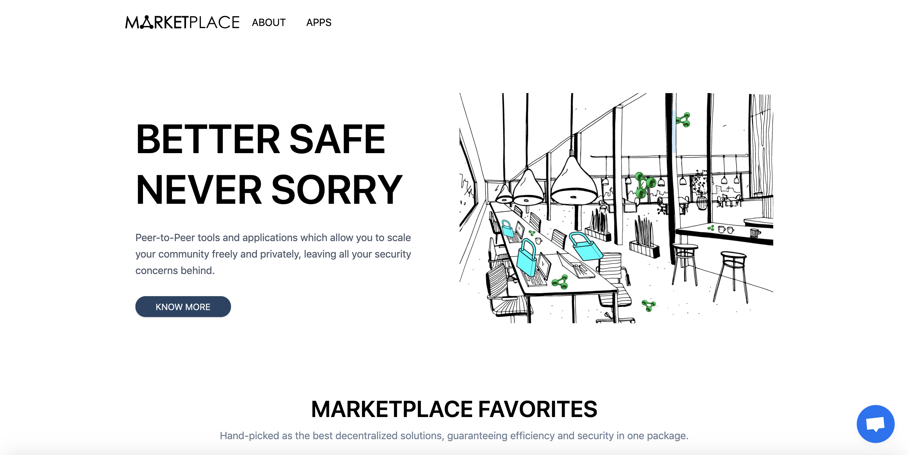
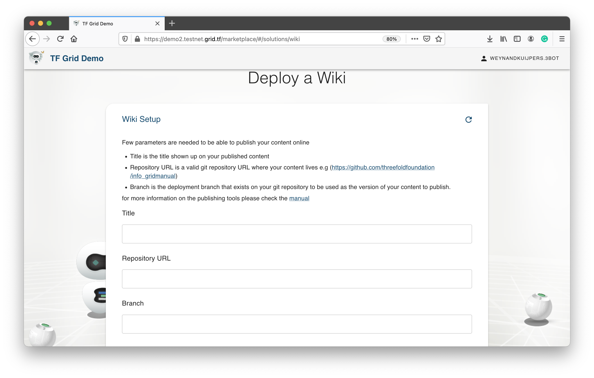

# Website Publisher

 

For website creation and management, there are many options available in the market – from total end-to-end solutions like Squarespace to do-it-yourself. ThreeFold has created publishing tool that allow for deployment and management with version control, automatic update, and staging facilities.

## What do you need to do?

First, please note that in order to deploy a website using this tool, you'll need some technical knowledge of Git.
 
 
The basic principle is that you create the content within a git repository (html, markdown). Content creation can be done with any tools that you have experience with (or like). The only requirement is that you store the content in a public or private repository. For example, you can use Github, but also ThreeFold's decentralized Gitea solution. The actual deployment of the webserver infrastructure and all required domain setup for a website to be publicly available is done in the one-click (and three questions) deployment.
 
 
All ThreeFold websites has been developed using the website publisher tool!

## How to Deploy

Please visit [the Marketplace Wiki](https://threefold.io/info/cloud#/cloud__evdc_marketplace) to find instructions!
 
 
If you need any support, please join [our Testing Community](https://bit.ly/tftesting) or visit [our forum](https://forum.threefold.io)!

<!--

## Why use these solutions?

While the tools available in the market tend to make things quite easy, they come with disadvantaged.
 
 

- Primarily, they run your website on centralized cloud solutions, which brings strong issues around privacy and security.
- In addition, website builders generate closed source websites
  - This means you cannot access and export your work from these platforms easily
  - And you are stuck with the feature sets of these platforms until they decide to expand
  - Open source gives full control to website creators and full flexibility
 
 

Note that building and deploying a website using these tools does require more technical know-how and obviously the ease of use of website builders is a huge draw. So, in the short term this is not for everybody, but we'll be optimizing this for the everyday person as we go.
 

## Tutorial: How to Deploy

_Please note that in order to deploy a website, blog, or wiki using these tools you'll need some technical knowledge of Git._
 
 

- First, visit the marketplace and find the Website, Blog, or Wiki Publisher solution
- You'll be asked to enter a solution name – this can be anything and is simply to identify your specific deployment and will also be used in the deployment's unique URL
- Then you'll need to add a title, repository URL, and branch
  - Title is the name of your website, blog, or wiki
  - Repository is a valid Git repository where your content lives
    - The basic principle is that you create the content in the repository (HTML, markdown, and other) and store it in a repository. Content creation can be done with any tools that you have experience with (or like).
    - The only requirement is that you store the content in a public repository. This repository can be anything that stores code and provides version controlling. For example, you can use Github, but also ThreeFold's decentralized Gitea solution.
    - The actual deployment of the webserver infrastructure and all required domain name setup for the website to be publicly available is done in the one-click (and three question) deployment.
  - Branch is the deployment branch on your Git repository to be used as the version of content you want live on your website, wiki, or blog
- Once you enter this information, all you need to do is wait for the solution to deploy. You can keep an eye on the screen for progress.
- Upon completion, you'll see a link to view your solution live and it will remain live in your My Workloads section for three hours.

### Deploy

create widget which does following,
widget needs to be here in iframe

- [ ] size: small/mid/large
  - small limited amount of visitors per month
  - large ...
- [ ] location (mention more locations coming soon)
  - Ghent
  - Vienna
- [ ] name
  - name as used in solution (in the webui and on web)
- [ ] domain (name is prefix of this)
  - ava.tf
  - 3x0.me
  - refit.earth
  - co30.org
  - ninja.tf
  - base.tf
  - tf9.io
- [ ] git url
  - check in wizard git url works
- [ ] sshkey yes/no
  - if yes, ask sshkey for remote login

  - always deploy on ipv6 public
  - always deploy on webgateway

### Manual

- link to manual (TODO: check good enough)

 -->
